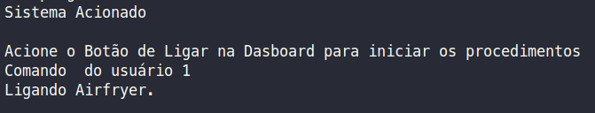
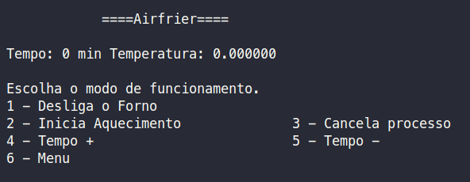
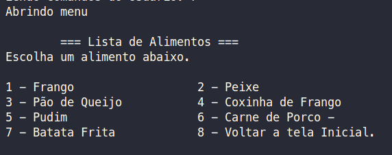
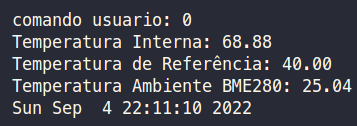

# Controle-AirFryer

Este repositório, consiste na resolução do trabalho 2 https://gitlab.com/fse_fga/trabalhos-2022_1/trabalho-2-2022-1/-/blob/main/README.md da disciplina de  Fundamentos de Sistemas Embarcados da UnB, onde é simulado o controle de uma Airfryer.

## Aluno
|Matrícula | Aluno |
| -- | -- |
| 170150747  |  [Marcos Vinícius](https://github.com/marcos-mv) |

## Como Executar a aplicação
* Faça o download deste repositório em uma das Raspberrys (43 ou 44)

      $ git clone https://github.com/marcos-mv/fse-trabalho-02.git

* Execute o arquivo `run.sh` na raiz do projeto

      $ sh run.sh

* Alternativamente voce pode executar os seguintes comandos nessa ordem:
    
      $ make clean
      $ make
      $ make run

* Após esses comandos, o programa iniciará na tela de configuração onde você poderá executar ações.

* Voce pode interagir com o programa através de uma das dashboards, dependendo de qual Raspberry esteja utilizando.

  * [Dashboard Rasp43](http://164.41.98.25:443/dashboard/657fba30-2706-11ed-be92-e3a443145aec?publicId=ba042a80-0322-11ed-9f25-414fbaf2b065)
  * [Dashboard Rasp44](http://164.41.98.25:443/dashboard/a4b10e40-1d8b-11ed-a520-7b07ee36c1c6?publicId=ba042a80-0322-11ed-9f25-414fbaf2b065)

## Como Utilizar a aplicação

Lista de funcionalidades na aplicação:
* Ligar Airfryer
* Desligar Airfryer
* Iniciar Cozimento
* Para Cozimento 
* Incrementar tempo de 1 em 1 minuto
* Decrementar tempo de 1 em 1 minuto
* Menu alimentos com seus tempos e temperaturas pré-definidos.

Algumas regras de uso:

* ***Bugs conhecidos e não corrigidos a tempo***: Ao apertar o botão na dashboard o sistema pode não conseguir reconhecer o comando tendo que se apertar várias vezes para o devido reconhecimento.

* Ao iniciar o Sistema será necessário acionar o botão "Ligar" na dashboard. Pode acontecer de o sinal não ser pego corretamente mas basta clicar mais vezes que o sistema irá acionar.

* Uma vez ligada a tela inicial irá mostrar o seguinte Menu.

* Nele será possível Desligar o Forno pela dashboard em qualquer momento.

* Ao acionar o Menu na Dashboard é listado uma série de Alimentos pré-definidos.

* Para escolher um alimento basta digitar no terminal o número associado ao alimento. 

* Ao selecionar o alimento o sistema volta a tela do Menu principal.

* Ao selecionar o processo de "Iniciar Aquecimento" na Dashboard o sistema irá informar as temperaturas dos sensores presentes.

